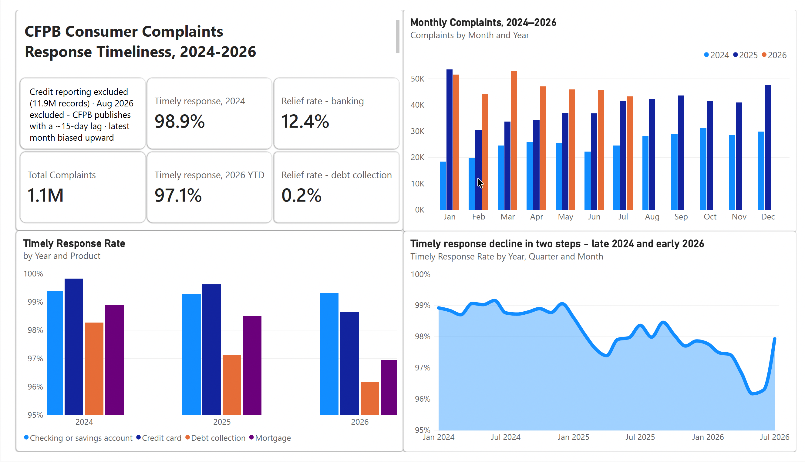
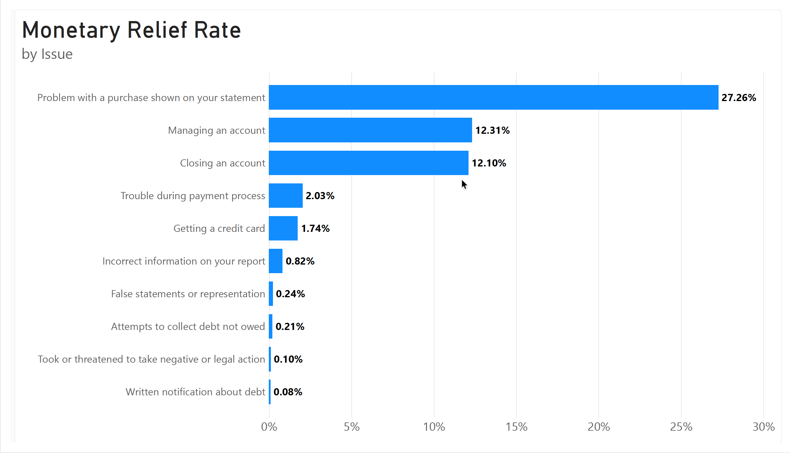
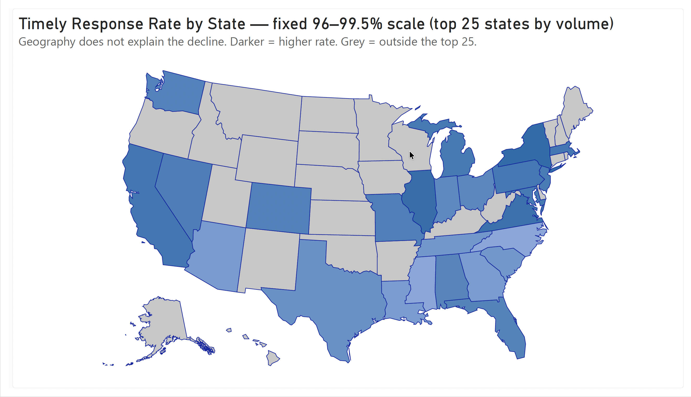

# CFPB Consumer Complaints — Response Timeliness (2024–2026)

Power BI dashboard analysing 1.1M US consumer finance complaints, built on a
DuckDB preparation pipeline.





---

## About
Initially data could not provide anything but around 100k filtered records or the entire unfiltered database. This is why I downloaded the entire 9GB file and utilized Duckdb in order to filter out the unnecessary data by using generic SQL syntax and also convert the .csv into .parquet because this file format is more optimized for work in Power BI in terms of sheer file size. Parquet is columnar and the compressed size was just 254 MB, and Power BI reads it far faster.
I restricted the scope to just four products and excluded credit reporting, which is 11.9M of the 17.4M complaints - roughly eleven times everything else combined. Left in, every aggregate becomes a credit reporting metric. It's also a different process: high-volume automated disputes over report entries, where monetary relief barely applies. The four remaining products vary in size, from 655K debt collection complaints to 68K mortgages, but every metric here is a rate within a category, so volume differences don't distort them.
Result: 1,145,121 complaints, January 2024 – July 2026.
I had the following questions at the start of this project:
Do complaints peak seasonally, and does response quality drop during peaks?
Which complaint types end in compensation, and which only get an answer?
Are some states worse than others?
2/3 of the answers turned out to be no.


---

## Data

**Source:** [CFPB Consumer Complaint Database](https://www.consumerfinance.gov/data-research/consumer-complaints/)
— public, updated continuously, 17.4M complaints in the full export.

**Scope:** 1,145,121 complaints, January 2024 – July 2026, four products:

| Product | Complaints |
|---|---|
| Debt collection | 655K |
| Credit card | 228K |
| Checking or savings account | 194K |
| Mortgage | 68K |

**Pipeline:** 9 GB raw CSV → filtered in DuckDB (CLI, plain SQL) → 254 MB Parquet
→ Power BI.

The full export is too large to load into Power BI directly, and most of it isn't
relevant to the question. DuckDB reads the CSV without loading it into memory, so
the filtering step runs on a laptop in under a minute. The Parquet output is the
only file Power BI ever touches.

Query: [`sql/filter_complaints.sql`](sql/filter_complaints.sql)

---

## Scope decisions

**Credit reporting excluded (11.9M records).** Credit bureau complaints are
roughly eleven times the volume of everything else combined. Left in, every
aggregate becomes a credit reporting metric — the dashboard would claim to be
about consumer complaints while reporting on three bureaus. It's also a
structurally different process: high-volume, largely automated disputes over
report entries, where monetary relief barely applies. I scoped to four products
whose response process is comparable.

**August 2026 excluded report-wide.** The CFPB publishes with roughly a 15-day
lag, so the final month of any export is partial. A date filter at the report
level cuts it.

**July 2026 kept.** I checked rather than assumed: 45,598 complaints in July
against 43,169 in June — 1,471 vs 1,439 per day. The month is complete.

**Dispute Rate replaced.** My first plan was to measure how often consumers
disputed the response. Field profiling showed the `Consumer disputed?` column
isn't in the dataset any more — the CFPB stopped publishing it after 2017.
I switched to Monetary Relief Rate, which is still populated.

---

## Model

**Fact table:** `complaints_filtered` (Parquet, 1.1M rows)

**Date table:** generated in DAX —

```dax
Calendar =
ADDCOLUMNS(
    CALENDARAUTO(),
    "Year",       YEAR([Date]),
    "Month",      MONTH([Date]),
    "Month Name", FORMAT([Date], "MMM"),
    "Year-Month", FORMAT([Date], "YYYY-MM"),
    "Week",       WEEKNUM([Date]),
    "Day Name",   FORMAT([Date], "ddd")
)
```

`Year-Month` is formatted `YYYY-MM` so it sorts chronologically as text — no
sort-by-column helper needed.

**Relationship:** `complaints_filtered[Date received]` → `Calendar[Date]`,
many-to-one, single direction.

**Measures:**

```dax
Timely Response Rate =
DIVIDE(
    CALCULATE(COUNTROWS(complaints_filtered),
              complaints_filtered[Timely response?] = TRUE()),
    COUNTROWS(complaints_filtered)
)

Monetary Relief Rate =
DIVIDE(
    CALCULATE(COUNTROWS(complaints_filtered),
              complaints_filtered[Company response to consumer]
                  = "Closed with monetary relief"),
    COUNTROWS(complaints_filtered)
)
```

---

## Findings

**1. Volume roughly doubled, with no seasonal pattern.**
January went 18K → 53K → 51K across the three years. Within each year, months
are flat.

**2. Timely response fell from 98.9% to 97.1%.**
<!-- вставь скриншот линейного графика -->

**3. The decline came in two steps, not gradually.**
2024 sits flat near 99%. The rate drops sharply across late 2024 into early
2025, holds on a new plateau through 2025, then drops again in early 2026 to a
low near 96.2%. A step suggests a change in conditions rather than slow drift.
I did not identify the cause.

**4. It's concentrated in two products.**
Debt collection 98.3% → 96.1%, mortgage 98.9% → 97.0%. Checking and savings
holds at 99.3%; credit card holds. Splitting by product rules out a composition
effect — this isn't the product mix shifting, it's specific products getting
slower.


**5. Monetary relief differs by a factor of about fifty.**
Banking issues 12–27% (problem with a purchase 27.3%, managing an account
12.3%), debt collection under 0.5%.

**6. Geography does not explain any of it.**
Across the 25 largest states the rate spans 97.2%–98.6% — about half the spread
across products.


**Together:** debt collection is rising in volume, falling in timeliness, and
almost never produces relief. Three independent metrics point at one category.

---

## What I checked and rejected

**Seasonality — rejected.** An apparent January peak in the first pass turned
out to be an artefact of an incomplete 2026: fewer months of data pulled the
early-month averages up. With the partial month excluded, the pattern disappears.

**Geography as an explanation — rejected.** The map exists to test this, not to
decorate. The colour scale is fixed at 96–99.5% rather than auto-fitted to the
data, so it's directly comparable to the product chart; on that shared scale the
states are close to uniform. Letting Power BI auto-fit would have stretched a
1.4-point spread across the full palette and made a non-finding look dramatic.

**Dispute Rate as a metric — dropped.** Field no longer published.

---

## Limitations

- The most recent month is biased upward. Complaints enter the public database
  once the company responds, so slow-response cases are under-represented at the
  leading edge of the series.
- The cause of the two step changes is not established. Company-level analysis
  would be the next step — whether the drop is spread across firms or driven by
  a few large debt collectors.
- Timeliness is self-reported by the responding company.

---

## Files

| | |
|---|---|
| `dashboard.pbix` | Power BI file |
| `dashboard.pdf` | Static export, all three pages |
| `sql/filter_complaints.sql` | DuckDB filtering query |
| `images/` | Page screenshots |

**Tools:** Power BI, DAX, DuckDB, SQL
